

<h1>
JamSpace - Music Collaboration Platform
</h1>

 

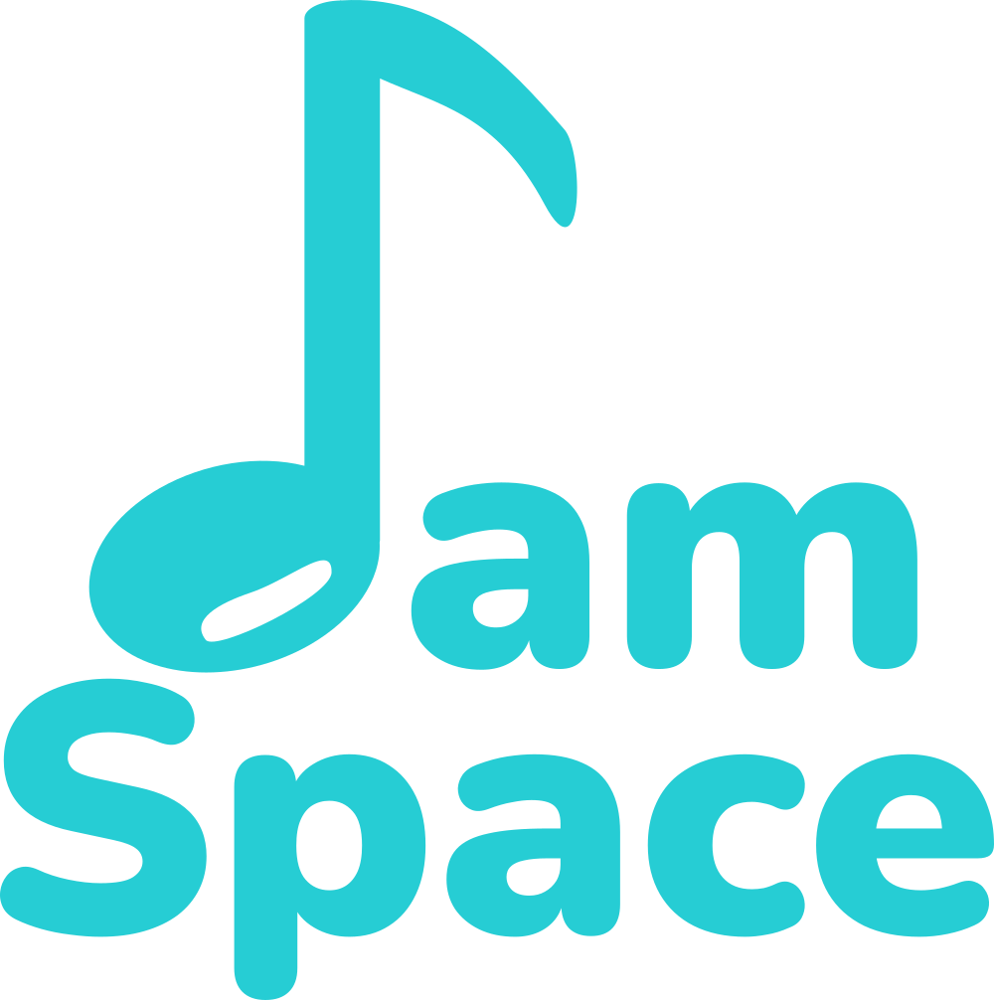

 

<strong>
ASP.NET Core • EF Core • Clean Architecture • React • MSSQL (Docker) • Azure Blob Storage • JWT
</strong>

 
 

---

## Overview
**JamSpace** is a web platform designed to help musicians collaborate remotely by combining social features with project and team management tools. The system enables artists to find collaborators, exchange ideas, manage workflows, and develop music projects within one unified environment.

The platform bridges market gaps identified during analysis, such as the lack of tools combining portfolio presentation, collaboration, audio file sharing, and structured team management.

This project was fully designed and developed by me, including system architecture, domain modeling, backend implementation, frontend application, and infrastructure setup. The entire platform was built from scratch as part of my engineering thesis.

---

## Implemented Features

### User Account & Profile
- Registration and login (JWT-based authentication)
- Password hashing and verification
- Secure authorization using JWT claims and role checks
- Account management:
  - change password
  - change email
  - delete account (soft delete)
- User profile management:
  - update display name
  - bio
  - location
  - musical skills
  - preferred genres
  - upload and update profile picture
- View user profiles

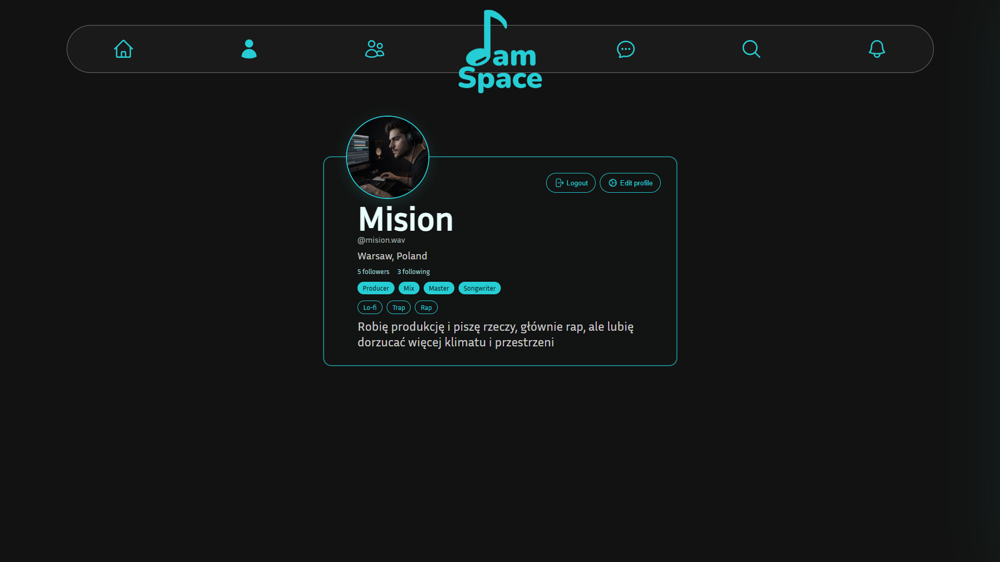

  
<b>More screenshots</b>

  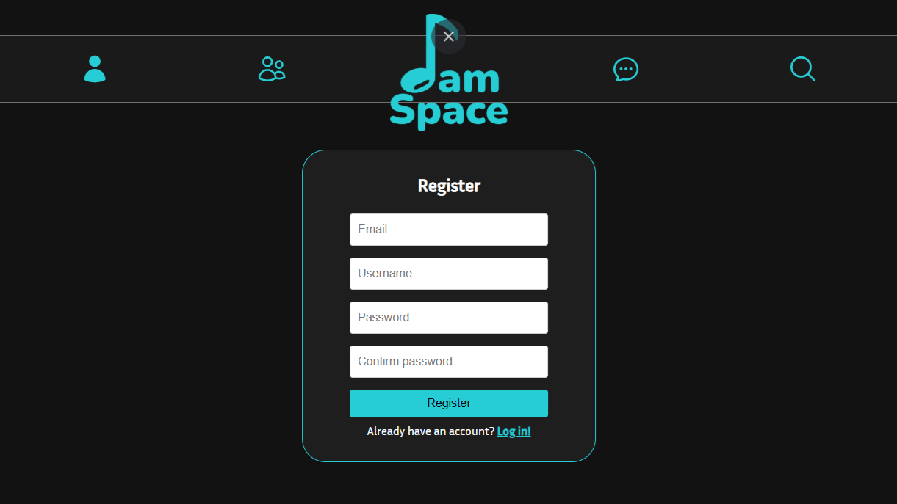
  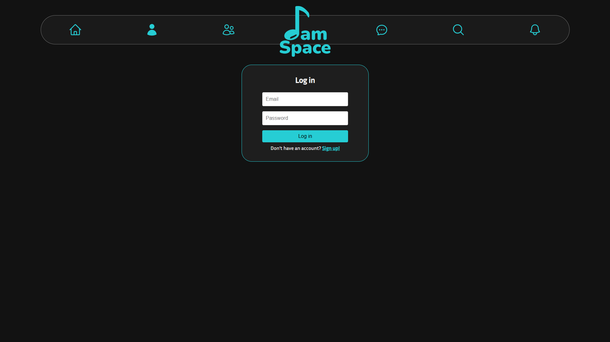
  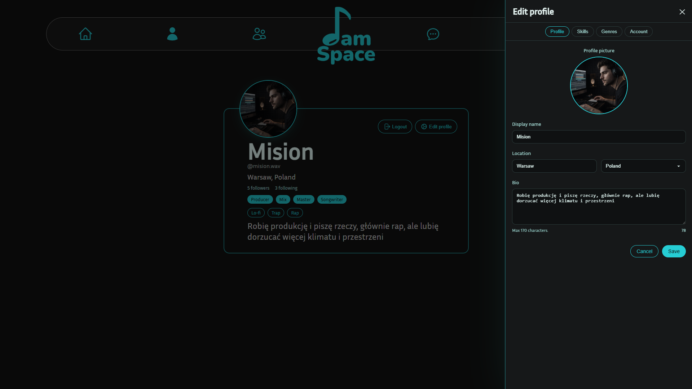
  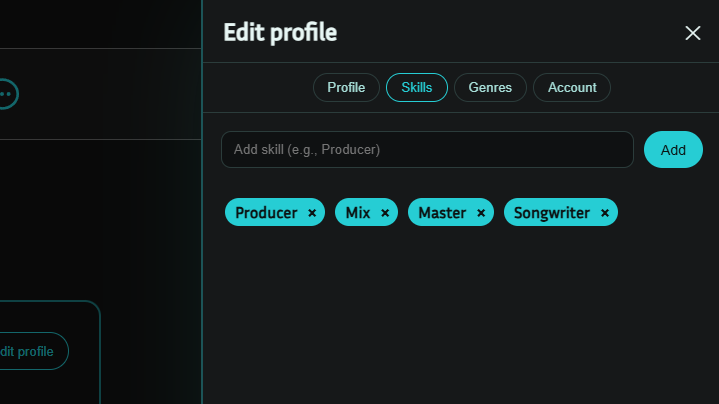
  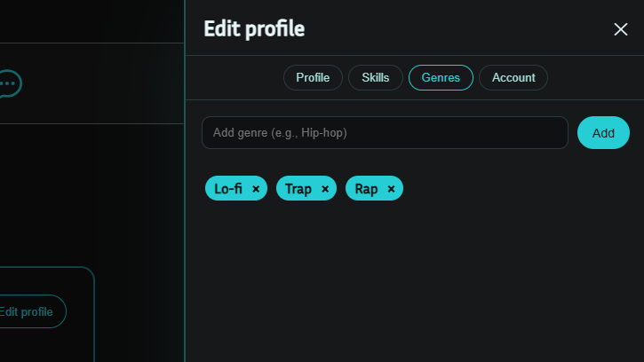
  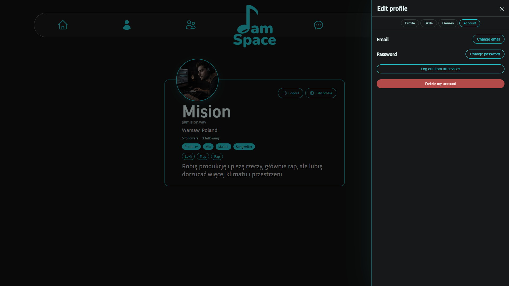

### Teams & Collaboration

- Create a team
- View all teams the user belongs to
- Upload team picture to **Azure Blob Storage**
- View team details with the user's role included
- Access control via `IsUserInTeam`

- Invite system:
  - send invitation to a user
  - accept invitation
  - reject invitation
  - view all pending invitations
  - enum-based invitation status
  - automatic assignment of team role after accepting

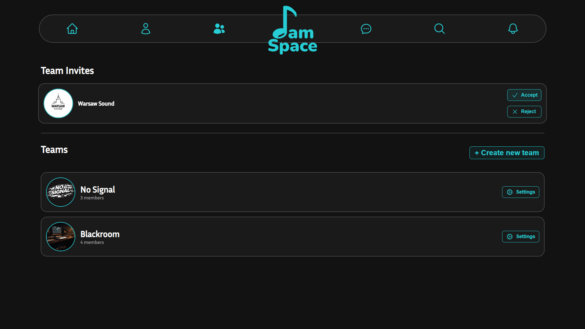

  
<b>More screenshots</b>

  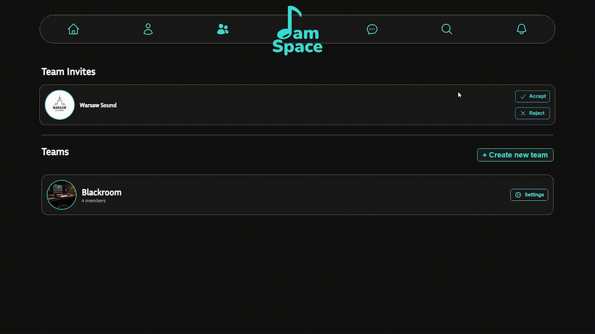
  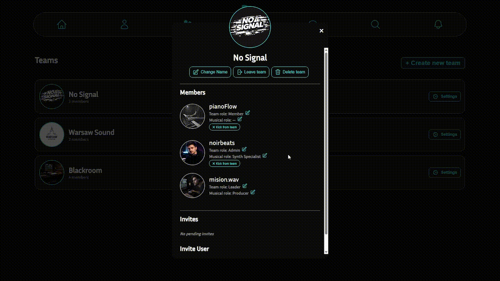
  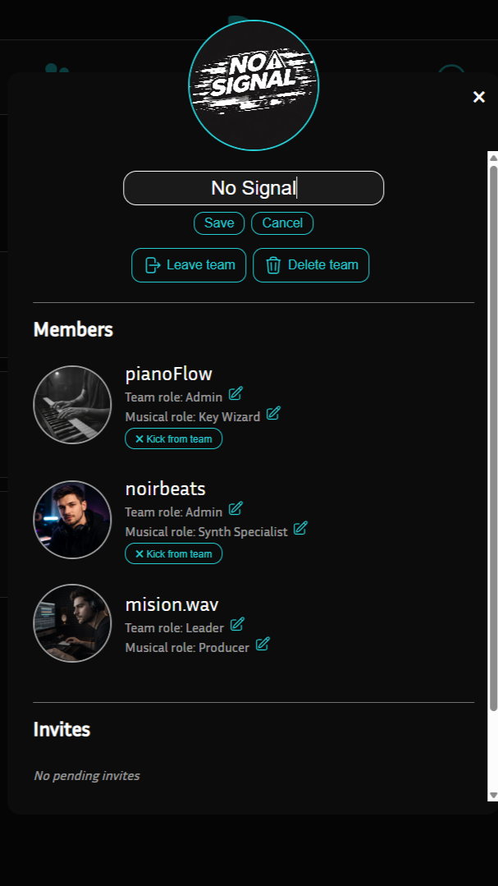
  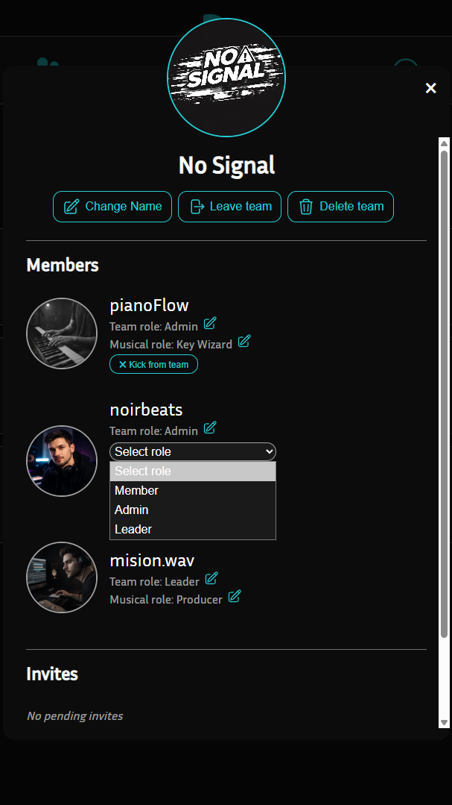

### Search
- Search users by username or display name
- Filter results based on:
  - location
  - musical skills
  - preferred genres
- Designed to support finding collaborators efficiently

  
<b>More screenshots</b>

  
  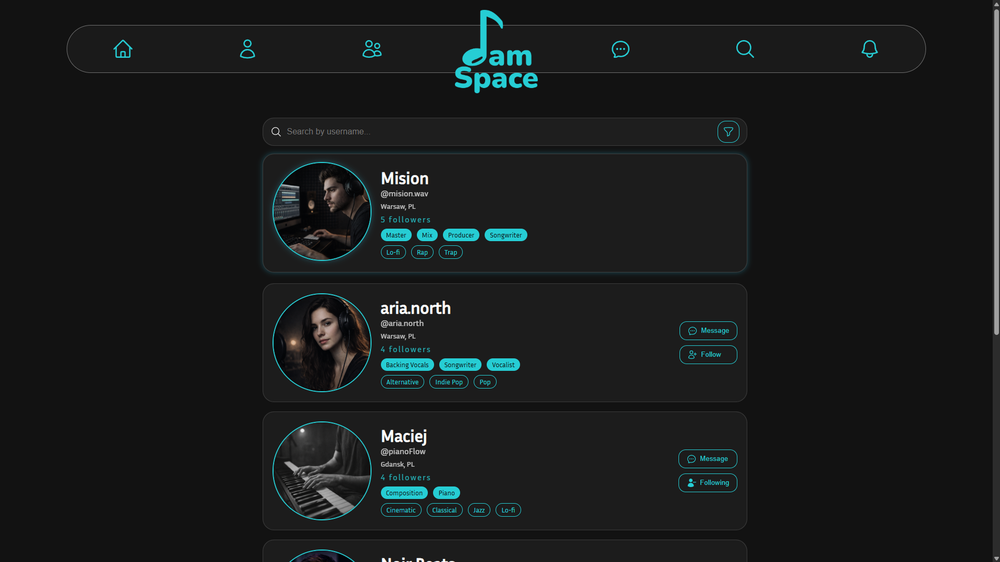
  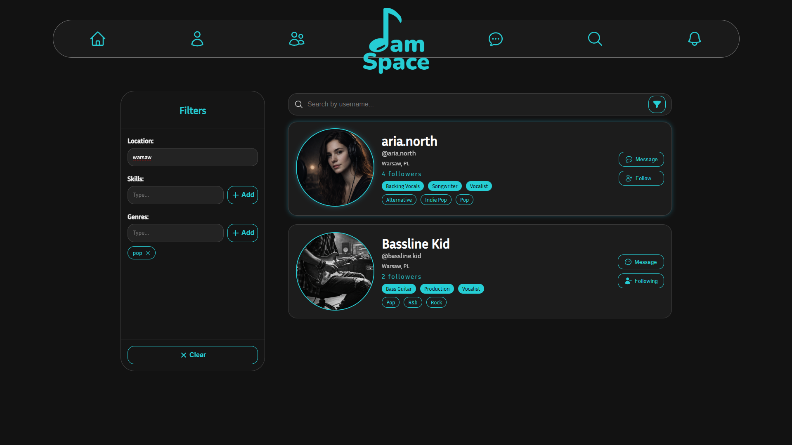

### Chat
- Real-time messaging between users
- One-to-one and team conversations
- Persistent message storage
- Backend handled via API with secure authorization

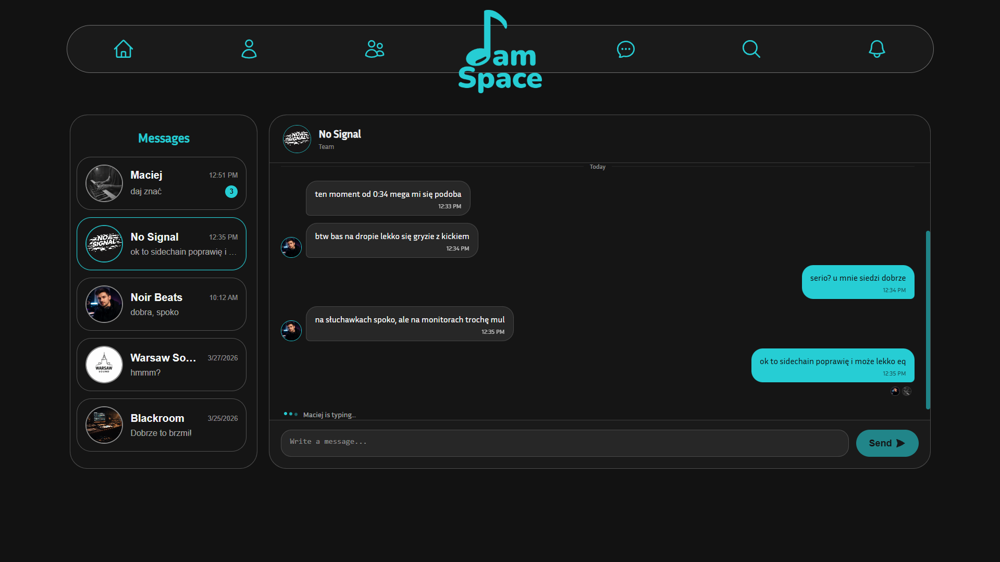

  
<b>More screenshots</b>

  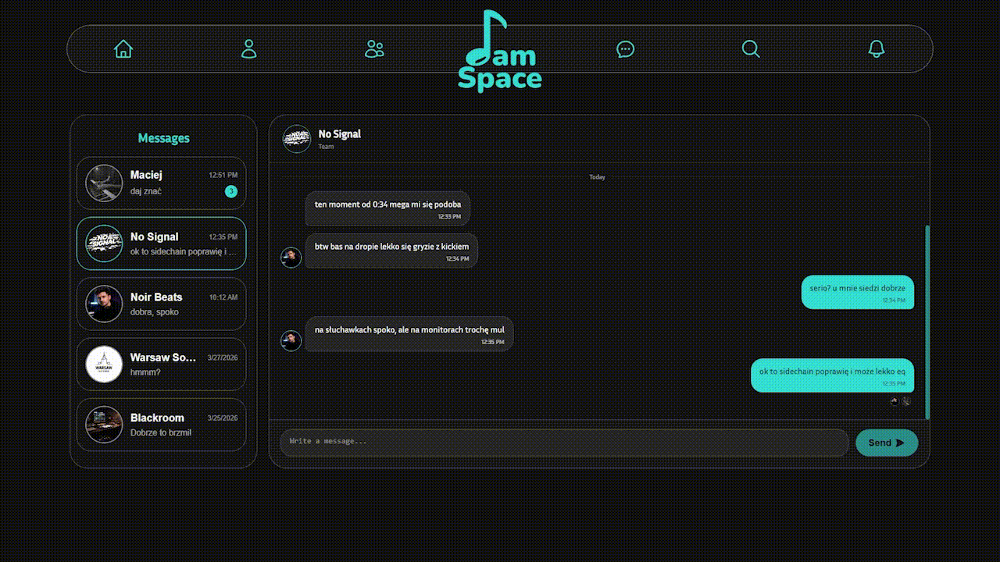
  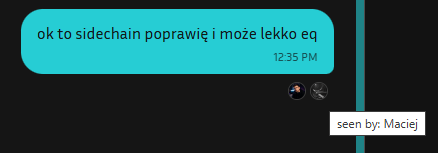

---

## Planned Features

### Feed & Social Features
- Posts (text, photos, shared tracks)
- Music-only feed (portfolio view)
- Likes and shares

### External Integrations
- Connect Spotify profile
- Connect SoundCloud profile
- Import tracks into user portfolio

### Project Workspace
- Audio player with time-based annotations
- General project notes
- Track version comparison
- Mentioning team members in notes

### Notifications
- New messages
- Event reminders
- Mentions

---

## Technology Stack

### **Backend**
- ASP.NET Core Web API
- Entity Framework Core (Code First)
- Clean Architecture
- CQRS pattern with MediatR
- MSSQL (Docker container)
- JWT authentication
- Azure Blob Storage for images/audio

### **Frontend**
- React with TypeScript
- Custom CSS (no UI framework)

---

## Architecture & Technical Details

- Complete **system design authored from scratch**, including domain model, entity relationships and system architecture

- Full modeling of business rules and data structures(teams, members, invites, user profiles, skills, genres, followers, etc.) translated into a clean and scalable domain-driven schema

- Fully structured **Clean Architecture** with strict separation of concerns(Domain -> Application -> Infrastructure -> API)

- Consistent use of **CQRS** with MediatR for all commands and queries

- Centralized **global exception handling** with unified error responses

- Authorization implemented through **JWT claims** with custom role checks

- Rich domain model with value objects, navigations and many-to-many relations (`UserSkill`, `UserGenre`, `UserFollows`)

- Usage of **Azure Blob Storage** for team images and profile pictures

- Containerized database environment using **SQL Server in Docker** for development setup

- Frontend built with TypeScript and modular structure (services, hooks, components)

- Manual and automated testing approach:
  - API testing via Swagger and Postman
  - Unit tests for business logic where applicable
